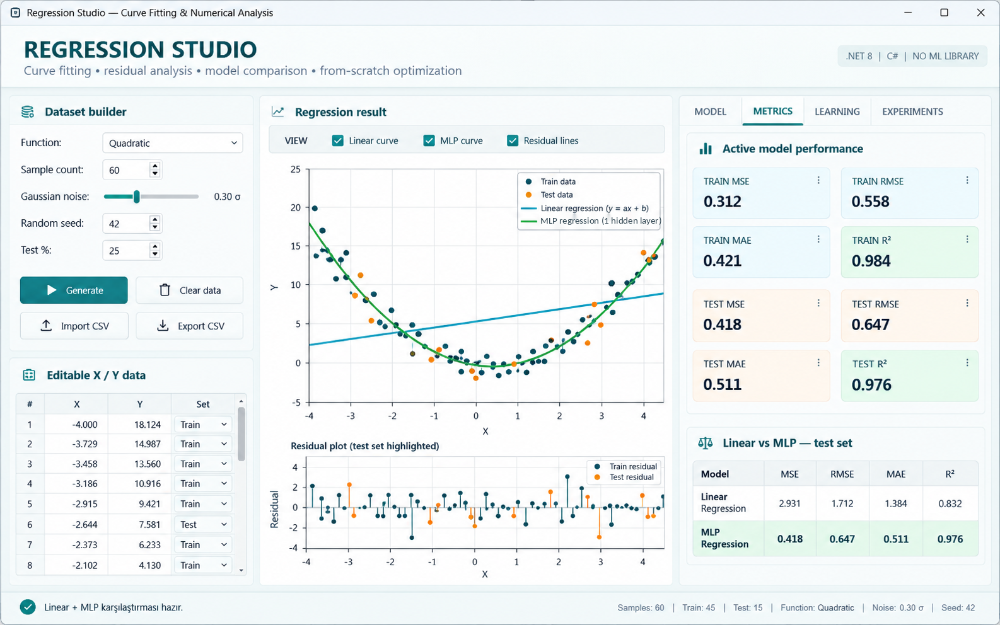

# Regression Studio — Regresyon Modelleri ve Etkileşimli Deney Laboratuvarı

C# ve **.NET 8 Windows Forms** ile geliştirilmiş, regresyon algoritmalarının çalışma mantığını uygulamalı olarak keşfetmek için hazırlanmış masaüstü uygulaması. Kullanıcı kendi iki boyutlu verisini oluşturabilir veya CSV'den yükleyebilir; **doğrusal regresyon** ile **çok katmanlı algılayıcı (MLP) regresyonunu** aynı veri kümesi üzerinde eğitip karşılaştırabilir.

> **Projenin amacı:** Regresyon algoritmalarını hazır model eğitimi kütüphanelerine devretmeden uygulamak; eğitim, tahmin, hata analizi ve hiperparametre etkisini tek bir görsel ortamda incelemek.

**Teknolojiler:** C# · .NET 8 · Windows Forms (WinForms) · özel çizim bileşenleri · GitHub Actions  
**Çalışma ortamı:** Windows · **Çözüm:** `RegressionStudio.sln` · **Başlangıç projesi:** `RegressionApp`

## Temsili arayüz önizlemesi

<!-- AI_ARAYUZ_GORSEL_BASLANGIC -->

<!-- AI_ARAYUZ_GORSEL_BITIS -->

Bu görsel, **RegressionStudio** kaynak kodundaki açık renkli Windows Forms düzenini, veri kümesi oluşturucusunu, regresyon eğrilerini, residual grafiğini ve **METRICS** sekmesini örneklemek için yapay zekâ yardımıyla hazırlanmıştır. **Gerçek uygulamadan alınmış bir ekran görüntüsü değildir.** Grafikteki örnekler, MSE/RMSE/MAE/R² değerleri ve karşılaştırma sonuçları ölçülmüş deney verileri olarak değerlendirilmemelidir.

## İçindekiler

1. [Özellikler](#özellikler)
2. [Kurulum ve çalıştırma](#kurulum-ve-çalıştırma)
3. [Hızlı başlangıç](#hızlı-başlangıç)
4. [Modeller ve eğitim yaklaşımı](#modeller-ve-eğitim-yaklaşımı)
5. [Veri kümesi, CSV ve grafik etkileşimleri](#veri-kümesi-csv-ve-grafik-etkileşimleri)
6. [Değerlendirme ve deneyler](#değerlendirme-ve-deneyler)
7. [Proje mimarisi](#proje-mimarisi)
8. [CI, doğrulama ve sınırlamalar](#ci-doğrulama-ve-sınırlamalar)
9. [Sorun giderme ve lisans](#sorun-giderme-ve-lisans)

## Özellikler

| Bileşen | İşlev |
| --- | --- |
| Veri oluşturma | Linear, Quadratic, Sinusoidal, Noisy Linear ve Nonlinear örnek veri kümeleri |
| Veri yönetimi | Grafikte nokta ekleme/sürükleme/silme, X-Y tablosunu düzenleme, CSV içe/dışa aktarma |
| Eğitim | Linear Regression veya MLP Regression; tek model ya da iki modeli art arda eğitme |
| Görselleştirme | Aynı grafikte doğrusal/MLP eğrileri, train/test örnekleri, residual çizgileri |
| Model analizi | MSE, RMSE, MAE, R²; eğitim ve test verisi sonuçları |
| Eğitim süreci | Öğrenme (hata) eğrisi ve model özeti |
| Deneyler | Learning-rate sweep ve epoch sweep; deney sonuç grafiği ve tablosu |
| Tahmin | Girilen tek bir X değeri için mevcut modellerin Y tahminlerini görüntüleme |

Arayüzdeki bazı buton ve sekme adları kaynak kodda **İngilizce** bırakılmıştır; bu dokümanda işlevleri Türkçe anlatılmaktadır.

## Kurulum ve çalıştırma

### Gereksinimler

- **Windows 10/11** (Windows Forms arayüzü nedeniyle).
- **.NET 8 SDK**.
- IDE tercih ediliyorsa **Visual Studio 2022** ve **.NET desktop development / .NET masaüstü geliştirme** bileşeni.
- Uygulama, çözümdeki iki yerel projeyi kullanır; modeli çalıştırmak için TensorFlow, ML.NET veya Accord.NET gerekli değildir.

### 1. Depoyu klonlayın

~~~powershell
git clone https://github.com/seydivakkas/RegressionStudio_ModernDashboard.git
cd RegressionStudio_ModernDashboard
~~~

### 2. Bağımlılıkları geri yükleyin ve derleyin

~~~powershell
dotnet --version
dotnet restore RegressionStudio.sln
dotnet build RegressionStudio.sln --configuration Release --no-restore
~~~

### 3. Uygulamayı başlatın

~~~powershell
dotnet run --project RegressionApp/RegressionApp.csproj --configuration Release
~~~

**Visual Studio ile:** `RegressionStudio.sln` dosyasını açın → `RegressionApp` projesini başlangıç projesi yapın → **F5**.

> Not: Çözümdeki `ML.Core`, `net8.0` hedefli sınıf kütüphanesidir; grafik arayüzü `net8.0-windows` hedefli `RegressionApp` içinde bulunur. Linux/macOS üzerinde derleme koşulları farklı olsa da WinForms uygulamasının çalışması Windows gerektirir.

## Hızlı başlangıç

1. **Dataset** alanından örneğin **Quadratic** türünü seçin; örnek sayısını, gürültüyü ve random seed'i belirleyin.
2. **Generate** ile noktaları oluşturun. İsterseniz grafikte örnekleri değiştirin veya veri tablosundaki X/Y değerlerini düzenleyin.
3. **Test %** alanından eğitim/test oranını seçin. Varsayılan değer **%25**'tir; veri ayrımı seçili seed ile oluşturulur.
4. **Train both** seçeneğine basın. Linear Regression ve MLP Regression aynı veri ayrımı üzerinde eğitilir.
5. Grafikte **Linear curve**, **MLP curve** ve **Residual lines** görünürlüğünü değiştirin.
6. Sağdaki **Model**, **Metrics** ve **Learning** alanlarını inceleyin. İlgili model seçimi metrik/özet görünümünü değiştirir.
7. **Predict** alanına X değeri girin; iki modelin tahminlerini karşılaştırın.
8. **Experiments** bölümünde **LR Sweep** veya **Epoch Sweep** çalıştırarak hiperparametre etkisini inceleyin.

**Önerilen gösterim:** Doğrusal olmayan bir veri kümesi üzerinde linear model ile MLP arasındaki uyum farkını, test MSE ve R² üzerinden yorumlayın. Sonuçlar üretilen veriye, seed'e ve eğitim ayarlarına göre değişebilir.

## Modeller ve eğitim yaklaşımı

### 1. Linear Regression

`ML.Core/Regression/LinearRegression.cs` sınıfı, tek değişkenli doğrusal regresyonu gerçekleştirir:

**Tahmin denklemi:** ŷ = w·x + b

- Giriş verisine ait ölçekleme işlemleri `StandardScaler1D` ile yürütülür.
- Parametreler **batch gradient descent** yaklaşımıyla güncellenir.
- Eğitim kaybı izlenir; gradyan sınırlama ve tolerans temelli erken durma mantığı bulunur.
- Eğitim sonrasında eğim ve kesişim bilgileri model özeti için kullanılabilir.

### 2. MLP Regression

`ML.Core/Regression/MlpRegressor.cs` sınıfında ağ yapısı **1 giriş → yapılandırılabilir ReLU gizli katman → 1 çıkış** şeklindedir.

- İleri yayılım ve geri yayılım (**forward/backpropagation**) elle uygulanmıştır.
- Ağırlık güncellemelerinde öğrenme oranı, **momentum** ve gradyan sınırlama kullanılır.
- Eğitim öncesi ölçekleme ve seed tabanlı ağırlık başlangıcı bulunur.
- Gizli nöron sayısı arayüzden değiştirilebilir (**2–128**).

**Varsayılan eğitim ayarları:** learning rate `0.01`, epoch `5000`, momentum `0.90`, gizli nöron `12`. Bunlar deney başlangıç değerleridir; en iyi sonucu garanti etmez.

### Model seçimi

| Özellik | Linear Regression | MLP Regression |
| --- | --- | --- |
| Temel yapı | Tek doğrusal fonksiyon | Gizli katmanlı sinir ağı |
| Beklenen avantaj | Doğrusal ilişkilerin yorumlanabilir modellenmesi | Doğrusal olmayan ilişkilerin öğrenilebilmesi |
| Eğitim | Batch gradient descent | Geri yayılım + momentum |
| Karmaşıklık | Düşük | Gizli katman ve epoch sayısıyla artar |

## Veri kümesi, CSV ve grafik etkileşimleri

### Hazır veri türleri

- **Linear:** Temel doğrusal ilişkiyi incelemek için.
- **Quadratic:** Parabolik davranışta lineer modelin sınırlarını görmek için.
- **Sinusoidal:** Periyodik örüntüyü modellemek için.
- **Noisy Linear:** Gürültünün doğrusal regresyona etkisini incelemek için.
- **Nonlinear:** Doğrusal olmayan örüntülerle deney yapmak için.

Örnek sayısı arayüzde **8–500**, test payı **%10–%50** aralığındadır. Gürültü `σ` değeri slider üzerinden değişir. Grafikteki düzenlemeler ve veri/ayrım değişiklikleri mevcut model sonuçlarının geçerliliğini etkileyebilir; uygulama uygun yerlerde model durumunu sıfırlar.

### CSV biçimi

**Import CSV** işlemi en az iki sayısal sütundan **X** ve **Y** değerlerini okur. Ayırıcı olarak virgül, noktalı virgül veya sekme tanınır; başlık ya da sayıya çevrilemeyen satırlar atlanabilir.

Örnek:

~~~csv
X,Y
-2,-3.5
-1,-1.2
0,0.1
1,2.2
2,3.9
~~~

**Export CSV** başlık olarak `X,Y,Set` yazar; her örneğin X, Y ve train/test bilgisini dışa aktarır. **Dikkat:** İçe aktarma sırasında kod yalnızca ilk iki sütunu kullanır; dışa aktarılan `Set` alanı yeniden içe aktarmada korunmaz, train/test ayrımı yeniden oluşturulur.

## Değerlendirme ve deneyler

| Metrik | Anlamı | Nasıl yorumlanır? |
| --- | --- | --- |
| **MSE** | Ortalama karesel hata | Küçük olması tercih edilir; büyük hataları daha fazla cezalandırır |
| **RMSE** | MSE'nin karekökü | Hedef değişkenin birimiyle aynı ölçektedir |
| **MAE** | Ortalama mutlak hata | Ortalama tahmin sapmasını gösterir |
| **R²** | Belirleme katsayısı | 1'e yaklaşması daha iyi uyumu gösterir; negatif olabilir |

**Train** metrikleri modele öğretilen örneklerdeki, **Test** metrikleri ise eğitimde kullanılmayan örneklerdeki performansı gösterir. Değerlendirme sırasında en az **6 veri noktası** gereksinimi arayüz tarafından kontrol edilir.

**LR Sweep**, seçili öğrenme oranının yaklaşık **0.25×, 0.5×, 1×, 2×, 4×** değerleriyle geçici modeller eğitir. **Epoch Sweep**, mevcut epoch değerinin kesirlerini ve kendisini karşılaştırır. Deney tablosu **Test MSE**, **Test R²** ve uygulanan epoch sayısını gösterir. Bu taramalar sistematik bir hiperparametre optimizasyon sistemi değil, öğretici karşılaştırma deneyleridir.

## Proje mimarisi

~~~text
RegressionStudio_ModernDashboard/
├── RegressionStudio.sln
├── RegressionApp/                   # WinForms kullanıcı arayüzü
│   ├── MainForm.cs                  # Ekran, olaylar, veri ve eğitim akışı
│   ├── DatasetGenerator.cs          # Sentetik veri
│   ├── RegressionPlotPanel.cs       # Noktalar, eğriler, residual çizgiler
│   ├── ResidualPlotPanel.cs         # Hata görselleştirmesi
│   ├── LearningCurvePanel.cs        # Öğrenme eğrileri
│   ├── ExperimentChartPanel.cs      # Sweep sonuçları
│   └── RegressionApp.csproj
├── ML.Core/                         # Arayüzden bağımsız algoritmalar
│   ├── Regression/
│   │   ├── IRegressor.cs
│   │   ├── LinearRegression.cs
│   │   ├── MlpRegressor.cs
│   │   ├── RegressionMetrics.cs
│   │   └── RegressionValidation.cs
│   ├── Preprocessing/StandardScaler1D.cs
│   └── ML.Core.csproj
└── .github/workflows/build.yml      # GitHub Actions
~~~

**İş akışı:** Veri üretimi/CSV → train/test ayrımı → `IRegressor.Fit` → `Predict` → metrikler → grafik ve deney panelleri.

## CI, doğrulama ve sınırlamalar

- `.github/workflows/build.yml`, **push** ve **pull request** sırasında Windows runner üzerinde .NET 8 ile **restore + Release build** çalıştırır.
- [GitHub Actions derleme sonuçları](https://github.com/seydivakkas/RegressionStudio_ModernDashboard/actions) görüntülenebilir.
- **Otomatik unit/integration test projesi bulunmamaktadır.** Başarılı derleme, matematiksel doğruluk veya tüm UI akışlarının test edildiği anlamına gelmez.
- Kaynak kodda kullanılan **hazır veri kümeleri sentetiktir**; gerçek dünya performansı ölçümü olarak sunulmamalıdır.
- **Modeli dosyaya kaydetme/yükleme özelliği bu projede bulunmaz.** CSV dışa aktarma veri içindir.
- Büyük epoch değerleri ve sweep işlemleri hesaplama süresini artırabilir.
- Ölçülmüş benchmark, gerçek veri üzerinde doğrulanmış başarı oranı veya ekran görüntüsü bu README'de iddia edilmez.

## Sorun giderme ve lisans

**`dotnet` bulunamadı:** .NET 8 SDK kurulumunu doğrulayın ve terminali yeniden açın.  
**Windows Forms çalışmıyor:** Uygulamayı Windows üzerinde çalıştırın; `RegressionApp` projesini başlatın.  
**Eğitim başlamıyor:** En az 6 geçerli X/Y noktası bulunduğunu kontrol edin.  
**CSV içe aktarılamıyor:** Dosyada en az iki sayısal sütun olduğundan emin olun; ondalık/ayırıcı biçimlerini kontrol edin.  
**Beklenmedik sonuçlar:** Gürültüyü azaltın, seed'i sabitleyin, learning rate/epoch parametrelerini karşılaştırın.

**Lisans:** Depoda `LICENSE` dosyası bulunmamaktadır. Herkese açık GitHub deposu, kendi başına bir açık kaynak kullanım lisansı vermez; yeniden kullanım koşulları depo sahibi tarafından belirlenmelidir.

**Kapsam:** Eğitim, görsel keşif ve makine öğrenmesi algoritmalarını anlama amaçlıdır; üretim ortamı veya kritik karar sistemleri için doğrulanmış bir çözüm olarak sunulmaz.
